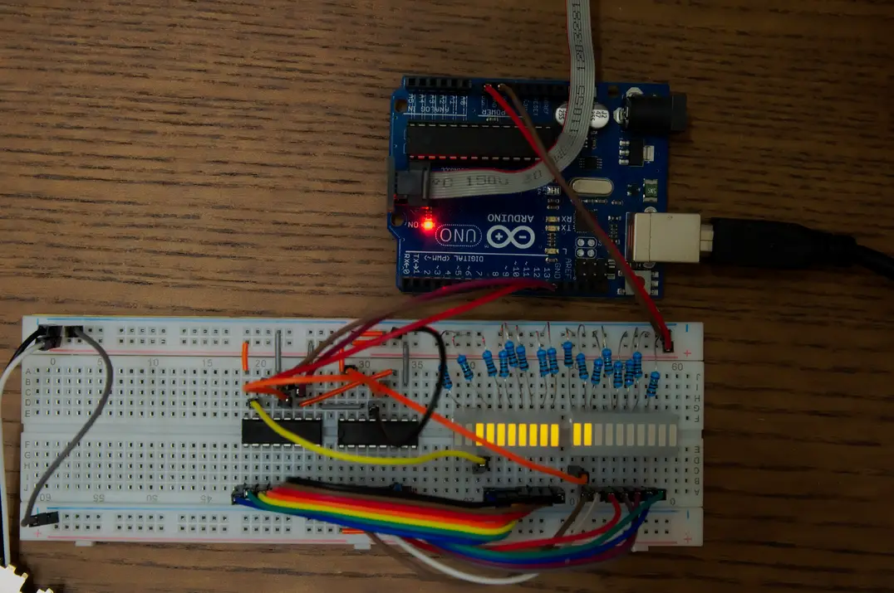
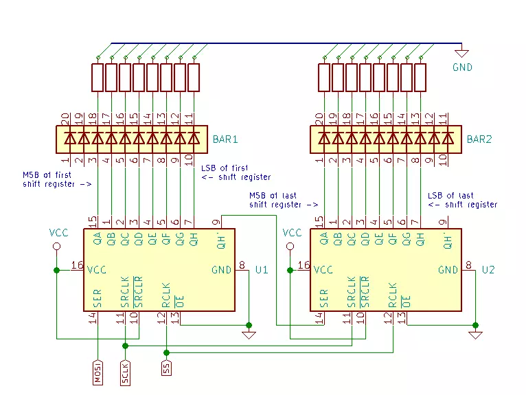
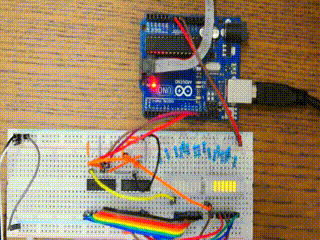
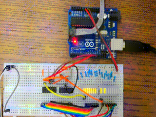

# Description
Daisy-chained 74HC595 shift registers using AVR SPI peripheral.

## Makefile

`make` compiles the demo.  
`make flash` compiles and flashes the demo to device.  
`make clean` deletes compiled code/cleans.  

### Programmer
Change `PROGRAMMER` to your programming device (consult `avrdude` docs).  
In this case, `jtagice3` is used.

### MCU clock
Defined by `F_CPU`, for Arduino its 16MHz (16000000UL).  
This setting is fuse dependent (clock divisor bits, type of oscillator,
oscillator value).

## Circuit Description

  
*Circuit Diagram*

---

  
*Circuit Photo*

---

  
*Bit Order Diagram*

---

When daisy-chaining shift registers, the bytes sent fill from the last register
down the chain upwards (first byte is sent to U2).  
The `QA`<sup>1</sup> pin of the shift register corresponds to the **MSB** (Most
Significant Bit), the `QH`<sup>1</sup> corresponds to the **LSB** (Least
Significant Bit).


### Code Description

#### Counting from right

  


To count from 0 starting from the *right*, our first bit (1 in binary) must be
at the *right end* of the *last* LED bar graph which corresponds to the
`QH`<sup>1</sup> pin of the *last shift register* from the chain.  
In this arrangement, we send as **LSB** the lower byte of our 16-bit counter
*first*.  
**LSB** first mode is selected by setting the `DORD` bit of the `SPCR` register.
```
for(uint16_t i = 0; i < UINT16_MAX; i++)
{
        /* Register order: fills from last register down the chain
        * upwards.
        * Bits: MSB: Start at Q0 pin.
        *       LSB: Start at Q7 pin.
        */

        /* Increment from right to left */
        SPCR = _BV(SPE)|_BV(MSTR)|_BV(DORD); /* LSB */
        spi_write_16b(i);
        _delay_ms(1);
}
```

#### Counting from left

  


To count from 0 starting from the *left*, our first bit (1 in binary) must be at
the *left end* of the *first* LED bar graph which corresponds to the
`QA`<sup>1</sup> pin of the *first shift register* from the chain.  
In this arrangement, we send as **MSB** the lower byte of our 16-bit counter
*last*.  
**MSB** first mode is selected by clearing/not setting the `DORD` bit of the
`SPCR` register.
```
for(uint16_t i = 0; i < UINT16_MAX; i++)
{
        /* Register order: fills from last register down the chain
        * upwards.
        * Bits: MSB: Start at Q0 pin.
        *       LSB: Start at Q7 pin.
        */

        /* Increment from left to right */
        /* Send as MSB the upper bytes first */
        /* ((i & 0x00FF) << 8) | ((i & 0xFF00) >> 8) */
        SPCR = _BV(SPE)|_BV(MSTR); /* MSB */
        spi_write_16b(((i & 0x00FF) << 8) | ((i & 0xFF00) >> 8));
        _delay_ms(1);
}
```


---
1. `QA` and `QH` are also known as `Q0` and `Q7`.
